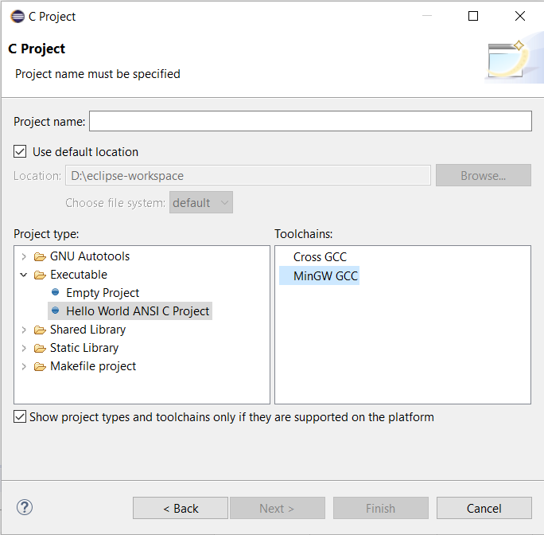
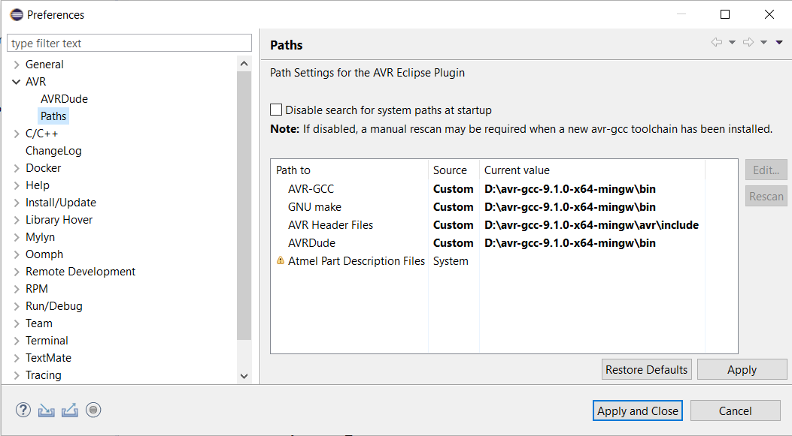

# Instalar Eclipse CDT (Windows)

- Esse é um guia para instalação "limpa" no Windows, sem necessidade de instaladores ou criação de entradas no registro do sistema.
- Baixar [Eclipse IDE for C/C++ Developers](https://www.eclipse.org/downloads/packages/) versão Windows 64-bit, pacote .zip
- Extrair o pacote zip em um diretório conhecido: C:\eclipse
- Certifique-se que a árvore de diretórios seja parecido com:
    ```
    c:\eclipse\+
               |- eclipse.exe
               |- configuration\
               |- (...)
    ```
- Baixar o [Java Runtime Enviroment portátil](https://portableapps.com/apps/utilities/java_portable_64)
- Instalar o Java portátil no diretório do eclipse. Ex: c:\eclipse\jre
- Certifique-se que a árvore de diretórios esteja parecido com:
    ```
    c:\eclipse\+
               |- eclipse.exe
               |- (...)
               |- jre\+
                      |- bin\java.exe
                      |- (...)
    ```
- Crie um atalho do eclipse.exe para a área de trabalho ou menu inicial.

# Instalar compilador C/C++

Compiladores livres (GNU GCC, Clang + LLVM) dependem de uma camada de tradução (POSIX -> WinNT) de chamadas de sistemas conhecida com minGW para executarem no Windows. Em instalações novas, recomenda-se a utilização do MSYS2.

```MSYS2 is a software distro and building platform for Windows. At its core is an independent rewrite of MSYS, based on modern Cygwin (POSIX compatibility layer) and MinGW-w64 with the aim of better interoperability with native Windows software. It provides a bash shell, Autotools, revision control systems and the like for building native Windows applications using MinGW-w64 toolchains. [https://www.msys2.org]```

- Baixar o [MSYS2](https://www.msys2.org/) 64-bit.
- Instalar o MSYS2 em um diretório conhecido, sem acentos, atalhos, etc:
    ```
    C:\msys64
    ```
- Após a instalação, execute o shell do MSYS2
- Atualize primeiramente o _runtime_ com:
```
pacman -Syu
```
- Ao final, feche a janela.
- Abra o MSYS2 64-bit (Atalho do Iniciar).
- Atualize os pacotes novamente com:
```
pacman -Syu
```
- Instalar o compilador e as farramentas de desenvolvimento ([mais detalhes aqui](https://www.devdungeon.com/content/install-gcc-compiler-windows-msys2-cc) e [aqui](https://www.devdungeon.com/content/how-setup-gcc-msys2-eclipse-windows-c-development)).
```
pacman -Sy base-devel mingw-w64-x86_64-toolchain
```
- O eclipse deve agora detectar automaticamente o compilador (mingw) na criação de um projeto C:



# Instalar compilador AVR e integrar ao Eclipse

- Plugin no Eclipse, siga  [essas](http://avr-eclipse.sourceforge.net/wiki/index.php/Plugin_Download) instruções:
    - No eclipse: Help -> Install new software
    - Use http://avr-eclipse.sourceforge.net/updatesite
    - Instale e feche o eclipse.
- Baixe o compilador [GCC 9](http://blog.zakkemble.net/avr-gcc-builds/), pacote .zip.
- Extrair o pacote zip em um diretório conhecido: D:\avr-gcc-9.1.0-x64-mingw
- Configure os caminhos:
    - No eclipse: Window -> Preferences.
    - Item AVR -> Paths.
    - Customizar conforme a figura abaixo.



- Para criar um projeto AVR no eclipse:
    - File -> New -> Project (__Não utilize C/C++ Project__).
    - Na janela, selecione __C Project__ e Next.
    - Selecione __AVR Cross Target Application__ e Next.
    - Selecione apenas __Release__ e Next.
    - Selecione o MCU, ex: __ATmega328p__ com frequência de 16MHz.
    - Crie um aquivo C: File -> New -> Source File
        - Nome: main.c

    - Para piscar um LED:

    ```C
    #include <avr/io.h>
    #include <util/delay.h>

    int main(){
        DDRB = 0xff;

        while(1){

            PORTB = 1;
            _delay_ms(1000);
            PORTB = 0;
            _delay_ms(1000);
        }
        return 0;
    }
    ```
    - Clique no ícone __Martelo__ ou __Ctrl+B__ para compilar.
    - Observe a saída na aba __Console__:
    ```
    Build Finished. 0 errors, 0 warnings. (took 1s.352ms)
    ```


