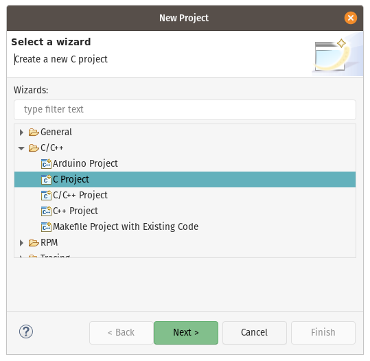
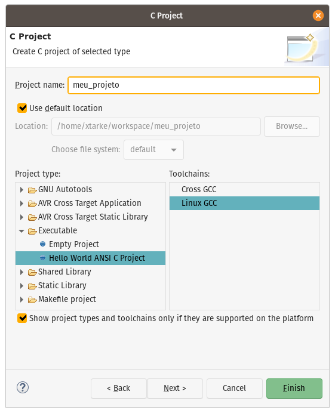
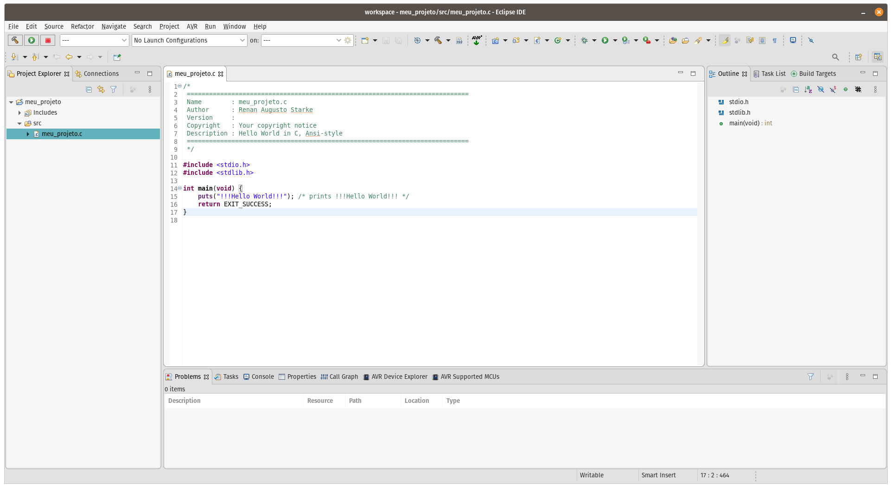

# Instalar Eclipse CDT (Linux)

## Instalação gneérica

1. Instalar os compiladores. Abra um __terminal__ e digite:

```bash
sudo apt update
sudo apt install build-essential
```
2. Testar. Ainda no __terminal__:

```bash
gcc --version
```

Saída esperada, utilizando Ubuntu 20.04:

```
  gcc (Ubuntu 9.3.0-10ubuntu2) 9.3.0
  Copyright (C) 2019 Free Software Foundation, Inc.
  This is free software; see the source for copying conditions.  There is NO
  warranty; not even for MERCHANTABILITY or FITNESS FOR A PARTICULAR PURPOSE.
```

3. Instalar o debugger e valgrind (verificador de problemas de memória):

```bash
sudo apt update
sudo apt install gdb valgrind
```

4. Instalar o Eclipse:

  - Baixar o [Eclipse CDT](https://www.eclipse.org/downloads/packages/):. **Selecione a versão Eclipse IDE for C/C++ Developers, Linux X86-64**
  - Extrair o arquivo (eclipse-cpp-2021-03-R-linux-gtk-x86_64.tar.gz) em algum diretório. Exemplo: /home/<juquinha>/eclipse
  
  - Instalar o java:

  ```bash
  sudo apt update
  sudo apt install openjdk-11-jre-headless
  ```
  
5. Para criar atalho.

  - Abra um editor de texto (ex. gedit) e crie o seguinte arquivo, salvando-o como **eclipse.desktop** em **/home/<juquinha>/**

```
[Desktop Entry]
Name=Eclipse
Exec=/home/<         juquinha          > /eclipse/eclipse
Icon=/home/<         juquinha          >/eclipse/icon.xpm
Type=Application
```

  - Copie eclipse.desktop para ./local/share/applications:

```bash
cp eclipse.desktop ~/.local/share/applications/
```

6. Abra o eclipse pelo menu de aplicações. Selecione um _workspace_ inicialmente.

  - Vá no menu File -> New -> Project.



  - Selecione as opções abaixo nomeando o seu projeto:



  - Use os botões abaixo para compilar, depurar ou executar seu projeto.




## Usando o epositório da instituição (apenas conectado na rede local do IFSC Campus Florianópolis)

- Esse é um guia para instalação do Eclipse no Linux utilizando as __mesmos conjuntos de softwares instalados nos laboratórios do DAELN__.

1. Instalar o flatpak no sistema (se não estiver instalado).
2. Adicionar o repositório

```bash
sudo flatpak remote-add --if-not-exists flatpak-daeln http://arquivos.eletronica.florianopolis.ifsc.edu.br/flatpak-daeln/flatpak-daeln.flatpakrepo
```

3. Instalar o Eclipse

```bash
sudo flatpak install flatpak-daeln io.github.GnuMcuEclipse
```

4. Instalar regras no udev (se não estiver instalado - utilizando a compilação de regras do PlatformIO).

```
sudo curl https://raw.githubusercontent.com/platformio/platformio-core/develop/scripts/99-platformio-udev.rules -o /etc/udev/rules.d/99-platformio-udev.rules
sudo udevadm control --reload-rules
```

- Se desejar liberar apenas o STLink, pode ser utilizado as seguintes regras no [udev](https://github.com/texane/stlink/tree/master/etc/udev/rules.d).
