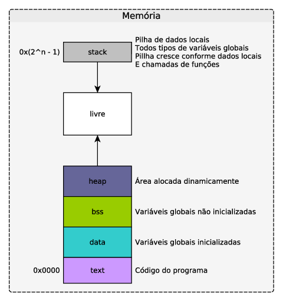

# Alocação dinâmica
---

Alocação dinâmica é um tópico muito importante de linguagem C. Ela permite criar estruturas de dados dinâmicas como listas encadeadas. Alocar memória dinamicamente permite armazenar dados sem conhecer o tamanho das estruturas durante a codificação do programa determinando o tamanho dos dados em tempo de execução.

Para alocar memória dinamicamente, é necessário criar uma variável do tipo ponteiro para armazenar o endereço do novo bloco de memória solicitado. Esse ponteiro é utilizado para acessar o novo bloco e também liberar essa memória após o uso.

Há quatro funções de alocação importantes definidas no cabeçalho __stdlib.h__:

```
/* Necessáro para malloc, calloc, realloc e free */
#include <stdlib.h>
```

```
/* Aloca um bloco de <size> bytes */
void *malloc(size_t size);

/* Aloca um bloco de (<nmemb> * <size>) bytes */
void *calloc(size_t nmemb, size_t size);

/* Realoca um bloco <ptr> de memória para <size> bytes*/
void *realloc(void *ptr, size_t size);

/* Libera um bloco <ptr> de memória */
void free(void *ptr);
```

Os blocos de memória alocados pela família de funções __alloc__ são criados no segmento de memória conhecido como __heap__. 




## Exemplos

* Para alocar um vetor de 32 inteiros:


```c
#include <stdio.h>
#include <stdlib.h>

int main(){
    int i;
    /* Ponteiro que guarda o início do bloco de memória */     
    int *vetor_din;
    /* Alocação dinâmica */
    vetor_din = malloc(16*sizeof(int));
    
    /* Abortar se não foi possível alocar */
    if (vetor_din == NULL){
        perror(__func__);   // Avisa ao usuário pq não alocou e em qual função
        return -1;
    }
    
    /* As duas instruções acima equivalem a: int vetor_statico[128]; */
    
    /* Exibe os dados do vetor. Pode haver valores aleratórios, nunca assuma 0 em todas as posições */
    for (i=0; i < 16; i++)
        printf("v[%d] = %d\n", i, vetor_din[i]);

    /* Deve-se liberar a memória dinâmica após o uso */
    free(vetor_din);

    return 0;
}

```

* Para alocar uma _string_ de forma dinâmica:


```c
#include <stdio.h>
#include <stdlib.h>

int main(){
    int i,tam;
    /* Ponteiro que guarda o bloco da string */    
    char *meu_nome;
    
    /* Pede ao usuário o tamanho */
    puts("Digite a quantidade de letras do seu nome:");
    scanf("%d\n", &tam);   // No windows, testar com scanf("%d\n\r", &tam);
        
    /* Alocação dinâmica: letras + final de string */
    meu_nome = malloc((tam + 1)*sizeof(int));
    
    /* Abortar se não foi possível alocar */
    if (meu_nome == NULL){
        perror(__func__);   // Avisa ao usuário pq não alocou e em qual função
        return -1;          //usar exit(-1) caso não em main
    }
    
    puts("Digite seu nome:");
    /* Fgets para considerar espaços e limitar o tamanho máximo */
    fgets(meu_nome, tam, stdin);
    
    /* Exibe os dados do vetor de caracteres */
    for (i=0; i < tam; i++)
        printf("nome[%d] = %c\n", i, meu_nome[i]);

    /* Deve-se liberar a memória dinâmica após o uso */
    free(meu_nome);

    return 0;
}
```

* Uso em estruturas:


```c
#include <stdio.h>
#include <stdlib.h>

struct veiculo{
    char marca[16];
    int ano;
};

int main(){
    int i;
    /* Ponteiro que guarda o início do bloco de memória */     
    struct veiculo *meu_carro;
    
    /* Alocação dinâmica: apenas um carro */
    meu_carro = malloc(1*sizeof(struct veiculo));
    
    /* Abortar se não foi possível alocar */
    if (meu_carro == NULL){
        perror(__func__);   // Avisa ao usuário pq não alocou e em qual função
        return -1;
    }
  
    puts("Entre com os dados do seu veículo:");
    puts("Marca:");
    scanf("%16[^\n]", meu_carro->marca);   // Usa-se o operador -> pois meu_carro é um ponteiro
    
    puts("Ano:");
    scanf("%d", &meu_carro->ano);// Usa-se o operador -> pois meu_carro é um ponteiro. Usa-se & pois ano não é um ponteiro
        
    puts("-------------");
    puts("Você digitou: ");
    printf("%s, ano %d\n", meu_carro->marca, meu_carro->ano);    

    /* Deve-se liberar a memória dinâmica após o uso */
    free(meu_carro);

    return 0;
}
```

* Uso em estruturas com typedef:


```c
#include <stdio.h>
#include <stdlib.h>

struct veiculos{
    char marca[16];
    int ano;
};

/* Cria o tipo veiculo_t conforme a stuct veiculos */
typedef struct veiculos veiculo_t;

int main(){
    int i;
    /* Ponteiro que guarda o início do bloco de memória */     
    veiculo_t *meu_carro;
    
    /* Alocação dinâmica: apenas um carro */
    meu_carro = malloc(1*sizeof(veiculo_t));
    
    /* Abortar se não foi possível alocar */
    if (meu_carro == NULL){
        perror(__func__);   // Avisa ao usuário pq não alocou e em qual função
        return -1;
    }
  
    puts("Entre com os dados do seu veículo:");
    puts("Marca:");
    scanf("%16[^\n]", meu_carro->marca);   // Usa-se o operador -> pois meu_carro é um ponteiro
    
    puts("Ano:");
    scanf("%d", &meu_carro->ano);// Usa-se o operador -> pois meu_carro é um ponteiro. Usa-se & pois ano não é um ponteiro
        
    puts("-------------");
    puts("Você digitou: ");
    printf("%s, ano %d\n", meu_carro->marca, meu_carro->ano);    

    /* Deve-se liberar a memória dinâmica após o uso */
    free(meu_carro);

    return 0;
}
```

* Uso em vetor de estruturas:


```c
#include <stdio.h>
#include <stdlib.h>

struct pontos {
  int x;
  int y;
};

typedef struct pontos ponto_t;

int main() {
    int i;
    /* Ponteiro que guarda o início do bloco de memória */
    ponto_t *meus_pontos;

    /* Alocação dinâmica: 3 pontos */
    meus_pontos = malloc( 3 * sizeof(ponto_t));
    
    /* Abortar se não foi possível alocar */
    if (meus_pontos == NULL){
        perror(__func__);   // Avisa ao usuário pq não alocou e em qual função
        return -1;
    }
    
    /* Colocando dados na estrutura, somente teste *
     * Aqui não se utiliza o operador -> devido ao operador [ ] */
    
    meus_pontos[0].x = 25;
    meus_pontos[0].y = 29;
    
    meus_pontos[1].x = -5;
    meus_pontos[1].y = 65;
    
    meus_pontos[2].x = 5;
    meus_pontos[2].y = 9;
    
    
    //Imprime os pontos:
    for (i=0; i < 3; i++)
        printf("Coordenadas dos meus pontos: %d, %d\n", meus_pontos[i].x, meus_pontos[i].y);

    free(meus_pontos);
    
    return 0;
}

```

* Utilização prática: uma função que retorna um vetor dinâmico contendo apenas números ímpares.


```c
#include <stdio.h>
#include <stdlib.h>
#include <time.h>

/* Gera um novo vetor contendo apenas os números ímpares de vetor_entrada */
int *impares(int *vetor_entrada, int tamanho, int *qtdImpares){
    int i,j = 0;
    int qtdI = 0;
    int *impares;

    /* Conta quantos ímpares há no vetor */
    for (i = 0; i < tamanho; i++)
        if (vetor_entrada[i] % 2 == 1)
            qtdI++;

    /* Aloca um novo vetor */
    impares = malloc(qtdI * sizeof(int));

    if (impares == NULL) {
        perror(__func__);
        exit(-1);
    }

    /* Copia os ímpares para o novo vetor */
    for (i = 0; i < tamanho; i++)
        if (vetor_entrada[i] % 2 == 1)
            impares[j++] = vetor_entrada[i];

    /* Atribui para a variável externa qtdImpares */
    *qtdImpares = qtdI;

    /* Retorna o novo vetor */
    return impares;
}


int main(int argc, char ** argv) {  
    /* Variáveis */
    int *numeros,*imp,qtdI, tamanho, i;

    /* Tamanho máximo de vetor de entrada: pode ser solicitado ao usuário  */
    tamanho = 20;
    
    numeros = (int*) malloc(sizeof(int) * tamanho);

    if (numeros == NULL)  {
        perror(__func__);
        exit(-1);
    }

    /* Alimenta o gerador de números aleatórios com o tempo atual */
    srand(time(NULL)); 
    
    /* Gera o vetor com números aleatórios */
    for (i=0; i<tamanho; i++)
        numeros[i] = rand() % 65535;

    /* Cria um novo vetor contendo apenas os números ímpares */
    imp = impares(numeros, tamanho, &qtdI);

    /* Exibe os números ímpares */
    for (i=0; i < qtdI; i++)
        printf("%d\n", imp[i]);        
    
    free(numeros);
    free(imp);

    return 0;
}
```

    63981
    13597
    46249
    4283
    60107
    33677
    5323
    38529


## Exercícios

* Digite e analise o funcionamento dos exemplos apresentados.


* Faça um programa que peça ao usuário o tamanho de um vetor de float.  Aloque espaço para esse vetor e peça para o  usuário entrar com os elementos do vetor. Chame uma função que retorne o somatório dos elementos do vetor, com o seguinte protótipo:

```
float sumVector(float *vec, int N);
```

* No mesmo estilo do item  anterior, mas agora a função deve retornar um novo vetor com a ordem doselementos invertida. O vetor também deve ser alocado dinamicamente. Teste de duas formas e aponte vantagens e possíveis problemas com cada versão.

    1. int* revertVector(int *vec, int N);
    2. void revertVector(int *revec, int *vec, int N);
    

* Aponte quais são os problemas dos 3 códigos abaixo.


```c
//Código 1
#include <stdlib.h>

int main(void) {    
    int *x = malloc(100);    
    return 0;
}
  

//Código 2
#include <stdlib.h>
int main() {    
    int *x = malloc(5);    
    x[5] = 3;    
    return 0;
}


//Código 3
#include <stdlib.h>

void f(void) {  
    free(x);
}

int main(void) {    
    int *x = malloc(100);    
    f();    
    free(x);    
    return 0;
}
```

* Peça ao usuário o tamanho de duas matrizes e os valores de cada elemento. Armazene os dados de cada matriz em uma estrutura do seguinte tipo:

```
struct _mat {  
    int* data;  
    int col;  
    int row;
};

typedef struct _mat mat;
```

    - Faça uma função que imprima os elementos da matriz, com o protótipo:

```
void printMatrix(mat* m1);```

    - Faça uma função para multiplicar as matrizes, observando que isso pode não ser possível, dependendo das dimensões das mesmas (nesse caso, a função deve retornar -1).Protótipo da função:

```
int printMatrix(mat* m1, mat* m2, mat *mresult);
```
